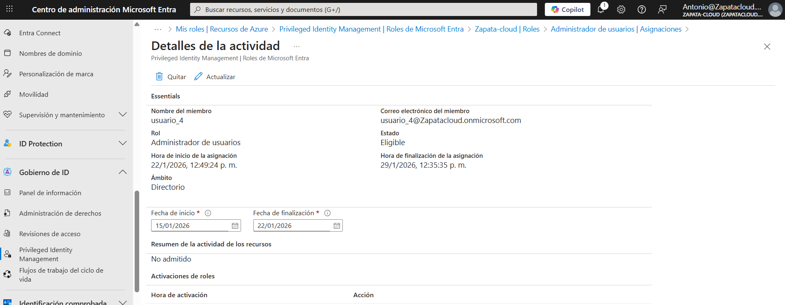
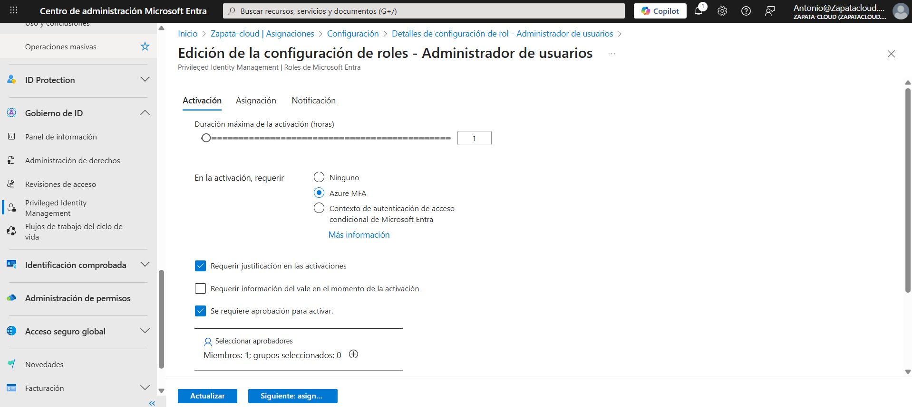
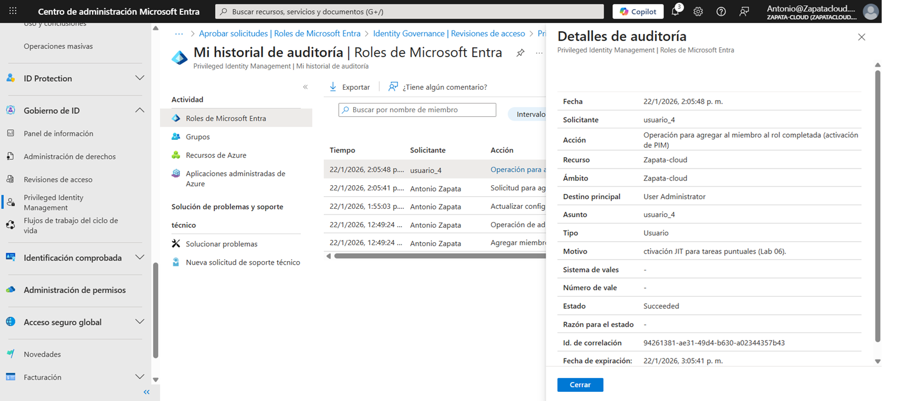
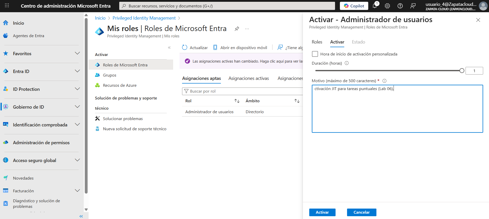
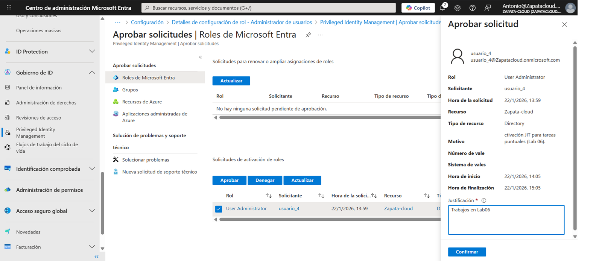
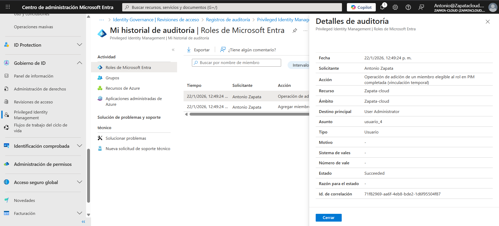

# Lab 06 — PIM (JIT): Gestión de privilegios bajo demanda con aprobación y auditoría | Microsoft Entra ID

## Contexto (por qué lo hice)
Mantener administradores permanentes aumenta la superficie de ataque y el impacto de cualquier compromiso de credenciales.  
En este lab aplico **Privileged Identity Management (PIM)** para trabajar con privilegios **Just-In-Time (JIT)**: el usuario queda **Eligible**, activa solo cuando lo necesita, con controles (MFA/justificación/aprobación) y evidencia en auditoría.

## Objetivo
Reducir privilegios permanentes mediante PIM:
- Asignaciones **Eligible (JIT)** en lugar de permanentes
- Activación temporal con **justificación**
- Flujo de **aprobación**
- Evidencia en **audit logs** (estado **Succeeded**)

---

## Requisitos
- Microsoft Entra ID con **PIM habilitado** (Identity Governance)
- Usuario de laboratorio: `usuario_4`

---

## Tareas realizadas
1. Asignación del rol **User Administrator** como **Eligible** a `usuario_4`.
2. Endurecimiento de la activación del rol:
   - Duración máxima: **1 hora**
   - Requerir **Azure MFA**
   - Requerir **justificación**
   - Requerir **aprobación**
3. Activación del rol desde **My roles → Activate** con `usuario_4` indicando motivo.
4. Aprobación de la solicitud y verificación de que la activación queda concedida.
5. Validación en auditoría: eventos **Succeeded** relacionados con la asignación/activación.

---

## Evidencias

### 01 — Eligible assignment creado

### 02 — Role settings (MFA + Justificación + Approval + 1h)

### 03 — Auditoría: Eligible assignment (Succeeded)

### 04 — Solicitud de activación (My roles → Activate)

### 05 — Aprobación / Activación concedida

### 06 — Auditoría: Activación completada (Succeeded)

---

## Checklist de verificación
- [x] El rol se asigna como **Eligible**, no como Active permanente
- [x] La activación está limitada en tiempo (**máx. 1h**)
- [x] La activación requiere **Azure MFA**
- [x] La activación requiere **justificación**
- [x] La activación requiere **aprobación**
- [x] Existe evidencia en **Audit logs** con estado **Succeeded**

---

## Qué explicaría en una entrevista / a un cliente
“Con PIM elimino administradores permanentes: los usuarios quedan **Eligible** y solo elevan privilegios cuando lo necesitan, por tiempo limitado y con **MFA + justificación + aprobación**. Además, todo queda registrado en **auditoría**, lo que mejora seguridad y cumplimiento.”
