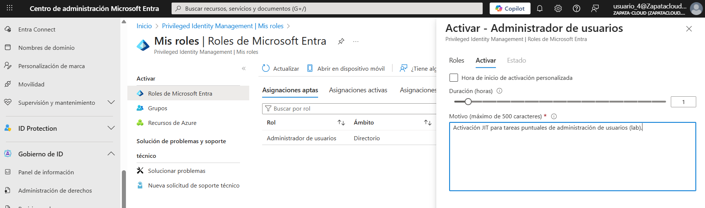

# Azure-Lab-06-PIM-JIT
🧪 LAB 06: Privileged Identity Management (PIM) - JIT
Repo: Azure-Lab-06-PIM-JIT

# Lab 06: Gestión de Privilegios Just-In-Time (PIM)

## 🎯 Objetivo
Eliminar administradores permanentes y reducir la superficie de ataque mediante activaciones **Just-In-Time (JIT)** con trazabilidad.

## 🛠️ Tareas realizadas
1. Asignación **Eligible** del rol **User Administrator** (sin privilegio permanente).
2. Activación del rol desde **My roles** con **justificación** (JIT).
3. Auditoría de la activación en **Audit history**.

## 📸 Evidencias

### 01 - Asignación Eligible (User Administrator)

### 02 - Activación JIT con justificación (My roles)

### 03 - Auditoría de activación (Audit history)

## ✅ Checklist de verificación
- [x] Rol no queda **Active** permanentemente (solo Eligible)
- [x] Activación requiere **motivo/justificación**
- [x] (Opcional) Duración limitada (ej. 1h) / MFA / Ticket si aplica
- [x] Logs de activación disponibles (Audit history)

## 🗣️ Qué le diría al cliente / entrevista
“PIM reduce riesgo: aunque roben una cuenta, no obtienen privilegios admin sin una activación controlada (JIT), con justificación y auditoría. Así minimizamos el tiempo de exposición y aumentamos trazabilidad.”
